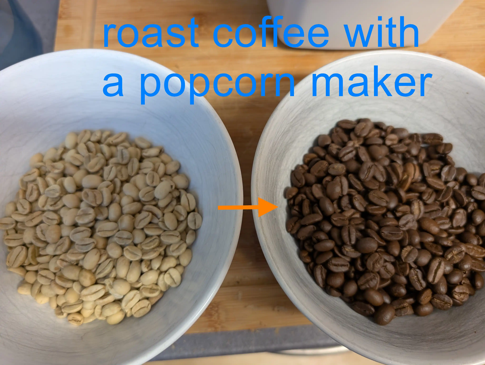

# CoffeeRoast

We built a coffee roaster from a popcorn machine by adding temperature control. It follows a reproducible roast curve.

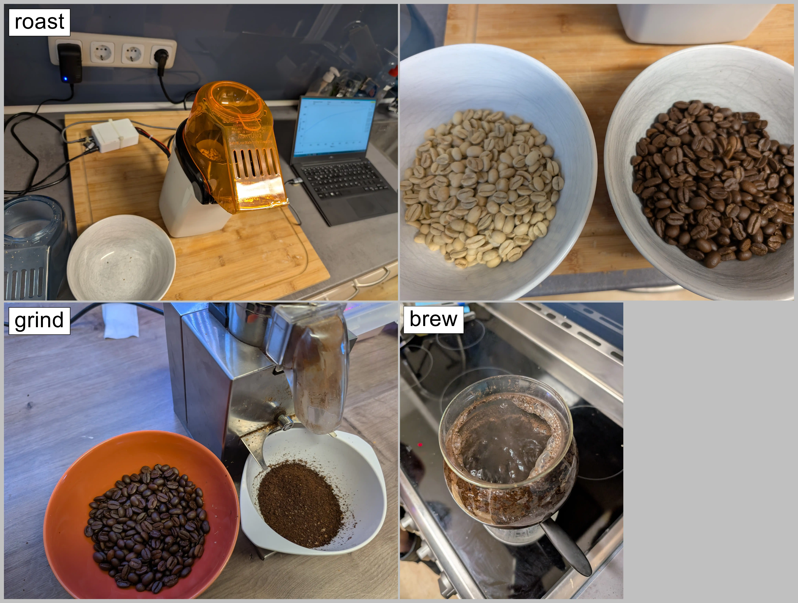

## Used Components

**Microcontroller:** LilyGo T-Display S3 ESP32-S3 (probably overkill, but it has a nice display and WiFi functionality if needed)  
From: [Amazon](https://www.amazon.de/LILYGO-T-Display-S3-Entwicklungsboard-Normalbildschirm-schwarzem/dp/B0BRTT727Z?source=ps-sl-shoppingads-lpcontext&ref_=fplfs&smid=ANWK9D8XV9DLB&th=1)

**Popcorn Maker:** [Severin Popcorn-Maker](https://popcorn-rezepte.de/severin-pc-3751-popcornautomat-weiss-heissluft)  
From: Ebay/Kleinanzeigen for 5-10€. People often get this as a gift, use it once or not at all, and then sell it on eBay.

**Temperature Sensor:** MAX6675 Temperature Sensor, K Type  
From: [Amazon](https://www.amazon.de/dp/B0DFM7SJ3Z?ref=ppx_yo2ov_dt_b_fed_asin_title)

**Solid State Relay:** Solid-State-Relay SSR-40DA  
From: [Amazon](https://www.amazon.de/dp/B0CDKCBJRT?ref=ppx_yo2ov_dt_b_fed_asin_title)

Cables, drills, screwdriver, soldering iron

## Instructions

To modify the roaster, we had to:
* Add a temperature sensor
* Add a solid-state relay to the heater
* Add a PWM transistor to the fan

First, we took apart the popcorn maker. It basically consists of two elements: heating coils and a fan for the air.  
These popcorn makers are engineered to the limit, so please be gentle with them as they are made of a lot of plastic. We destroyed a couple until we got it right. Even then, the plastic melted on the third continuous roast.

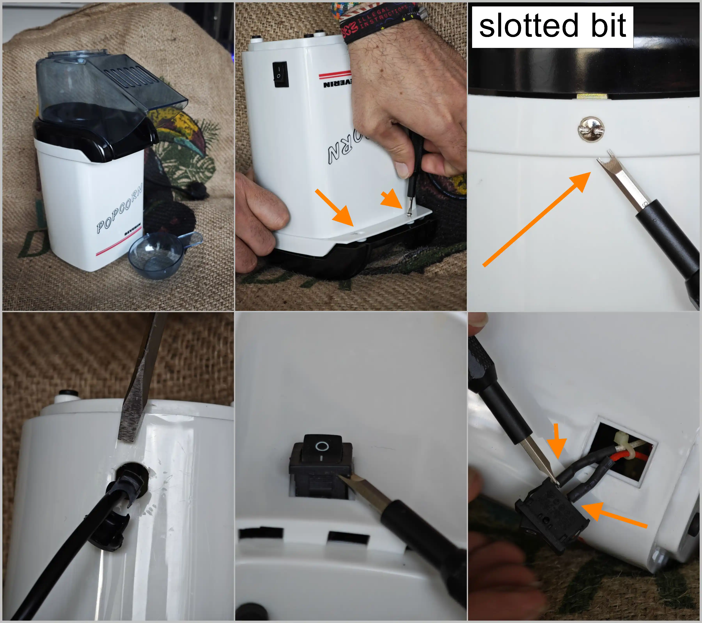

The main power switch connects the 230V from the outlet directly to the heating coils. The fan is connected to the heating coil in a way that ~24V AC goes through a rectifier (4 diodes) and is converted from AC to DC.

In the first step, we needed to decouple the heating coils from the fan and make the heating coil controllable using our solid-state relay. We disconnected the fan from the diodes so we could run it from an external power supply providing 24V later on.  
The heating coil was then soldered directly to the neutral conductor (blue wire). The red wire was cut, and the solid-state relay was installed in between so we could control the power of the heating element using PWM later.

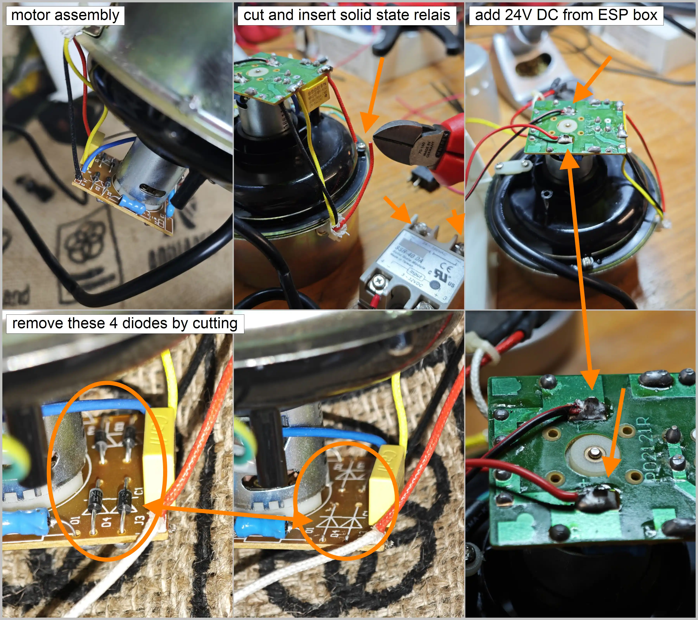

An external or lab power supply was used to provide 24V DC to the fan, so it runs permanently. The fan can take from 4V to 30V. We can adjust the voltage to control the speed or later use a GPIO, a diode, and a transistor to control it from the ESP32. The ESP ensures a smooth start of the fan. We broke one of the fans due to rapid spin up/down.

We drilled a hole in the top metal container to fit the thermocouple inside the roasting chamber.  
**Note:** If the temperature sensor touches the metal casing, it won't work properly. We insulated the sensor with Kapton tape or a non-conductive washer. The temperature reading is 0°C if the motor is spinning and no insulation was used. This is handled by the code to be filtered out, but the roaster will go into fail-safe mode after 30s of nonsensical temperature readings and spin up the fan to 100%.

The other 4 pins go into the ESP32 (VCC = 5V, GND = Ground, CLK = GPIO_13, CS = GPIO_12, DO = GPIO_11).

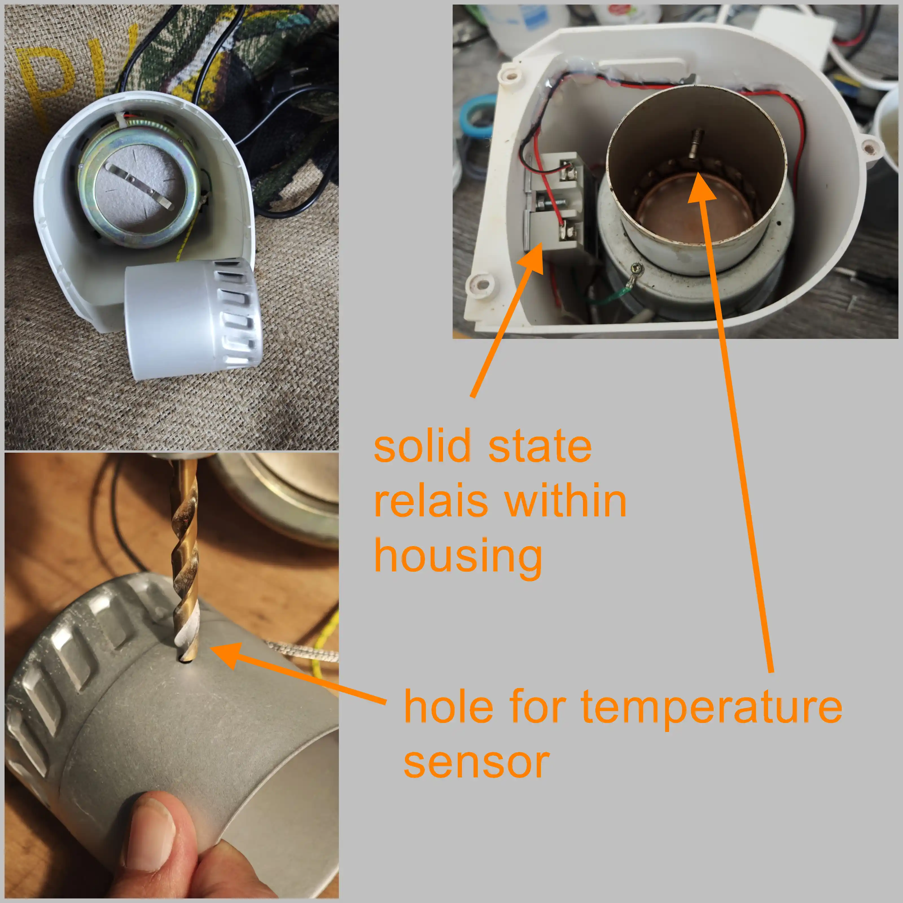

Also, the solid-state relay is connected to the ESP32. In our case, the voltage provided by the GPIO was sufficient to control the solid-state relay, so we controlled it directly via the GPIO. If this does not work, you will need a separate transistor and a 5V supply for the SSR.  
The SSR uses GPIO_1 in our setup.

## Control Box

We 3D printed a box containing:
* ESP32
* 24V Fan PWM control
* SSR (solid-state relay) control
* Temperature sensor readout board

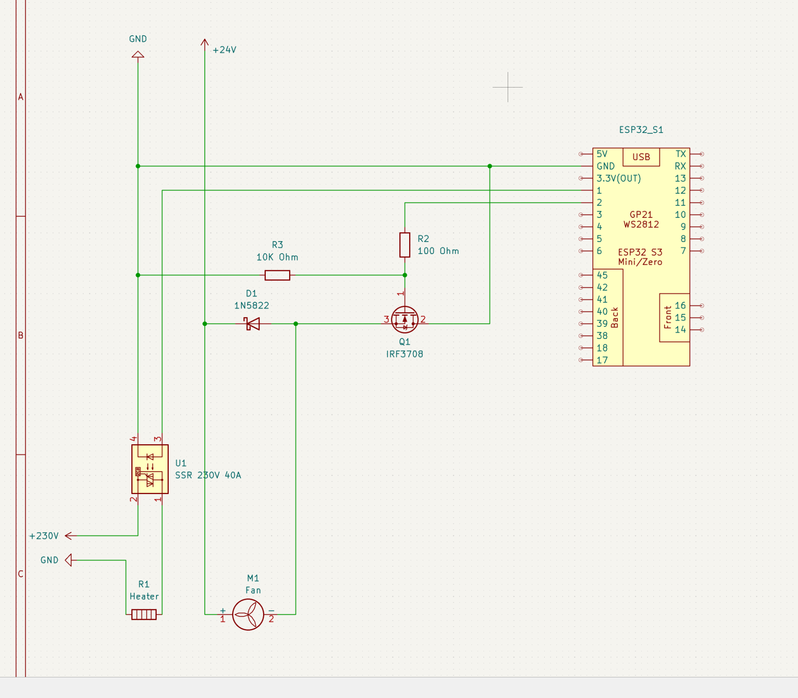

And that's it!

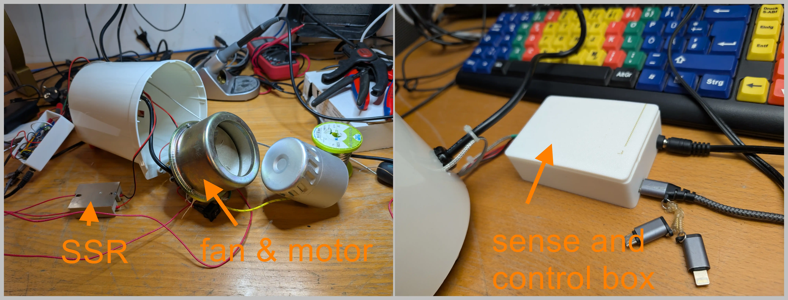

Initially, we wanted to use the ESP32 with Artisan (the software used for commercial products, e.g., Coffeelogic Nano), but we had no luck getting it to work with a PID. So, we decided to write our own software using C#. Communication is done via simple serial commands.  
You can send "get temp" via serial to the ESP32, and it will respond with the current temperature from the thermocouple.  
You can also send "set setpoint 255", which the ESP32 interprets to set the PWM duty cycle to 100% (255 = 100%, 128 = 50%, 0 = 0%).  
The C# application can be found in the iRoastControl folder.

# Example Usage

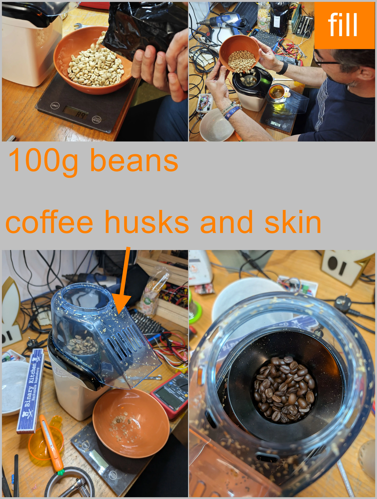

Use no more than 100g of beans and roast in a well-ventilated area. Prepare for coffee skins flying _everywhere_.  
You can stop the roast at any time by flipping the on-off switch, which effectively disconnects the heater while keeping the cooling fan running.

[12s_roast.webm](https://github.com/user-attachments/assets/c60a7ab9-1068-4cd1-9d56-9880ee272cc1)

[12s video of 12min roasting](docu/assets/img/rel/12s_roast.webm)

# iRoastControl

iRoastControl is the control software. It comes with predefined roast curves you can use for your first roast.

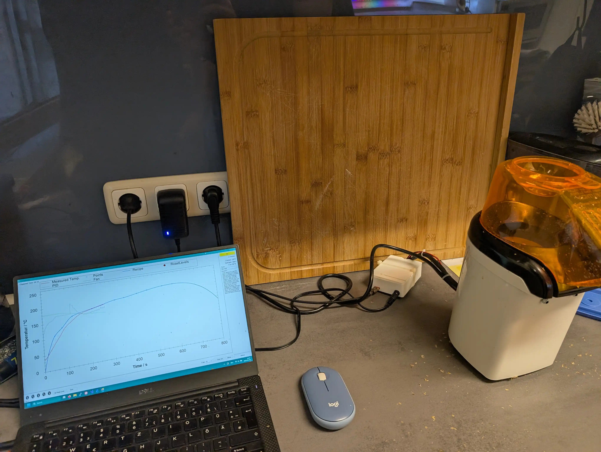

Each roasting curve has three phases: pre-heating, running, and cool-down. When you click "Run" the first time, the application will pre-heat the popcorn machine until it reaches 180°C. This is when you add your coffee beans. After that, press "Run" again and the button will turn yellow. This is where the roasting curve starts. You can follow your roasting temperatures by watching the red graph. Pressing the "Run" button again will abort and start the cool-down phase, where the heating element turns off and only the fan runs. When the temperature drops to room temperature, you are done.

## UI

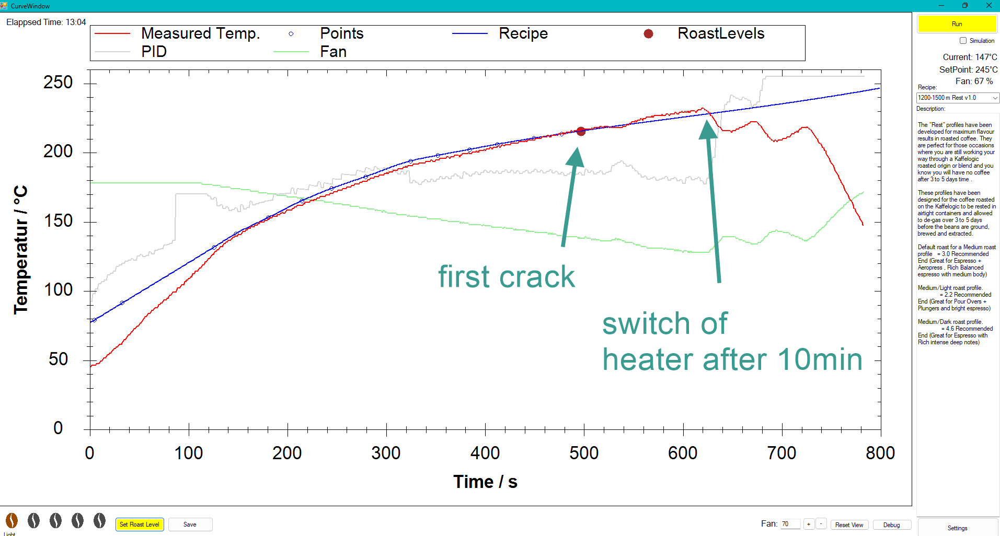

At the moment, the curves are defined by some points in the source code, which get interpolated using a CubicSpline function. You can find the key points in `ControlClass.cs` in the function `generateDefaultCurve()`. Each point describes the temperature depending on the time in seconds, e.g., `targetPoints.Add(new PointF(660, 180));` means at 660s of the roasting curve, we should reach 180°C.  
Adjust as you like.

# Fails

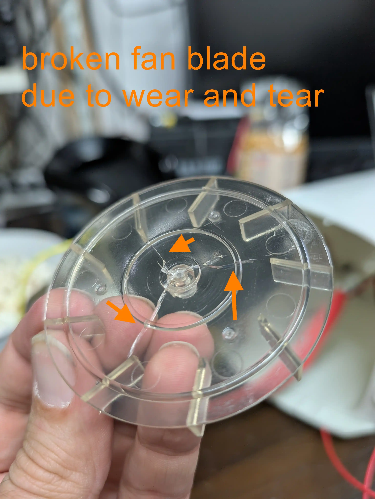

If the popcorn maker is old (like 20 years), the fan blades are rather brittle and may break easily if used on full power.

**Note:** If the temperature sensor touches the metal casing, it won't work properly. We recommend insulating the sensor with Kapton tape or a non-conductive washer.

# Tips

* Cover any holes on top with Kapton tape to retain heat better. Plastic might melt a bit, though.
* Test the roast with actual popcorn, as it's cheaper if anything goes wrong.
* Experiment and change only one setting at a time.

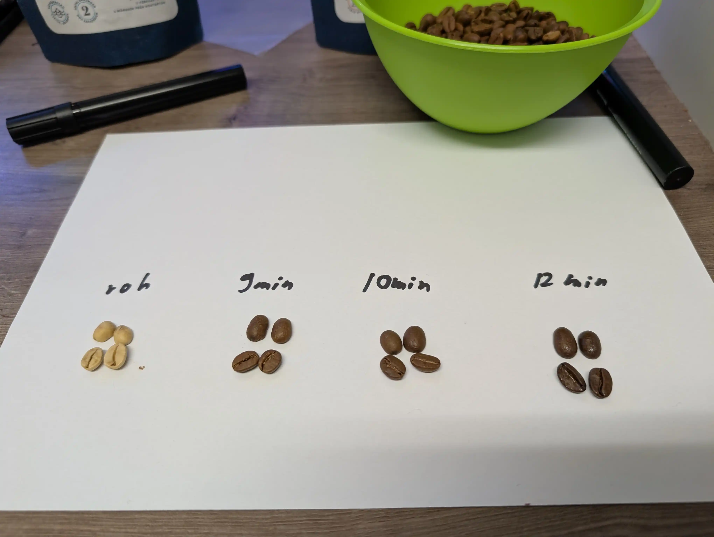
